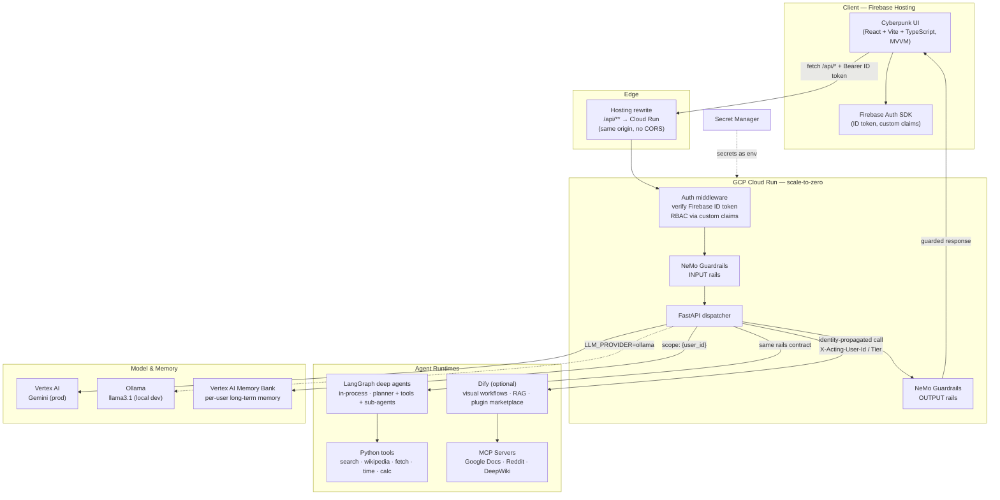
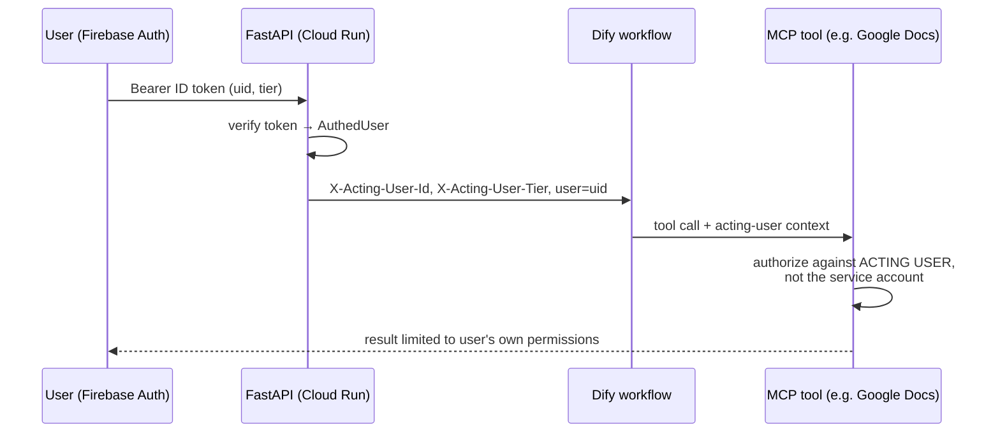

# AI Platform — Design Document

A production-grade, cost-optimized personal AI platform (ChatGPT-class, fully
customizable) built by and for a single developer. Custom cyberpunk UI on
Firebase Hosting, scale-to-zero FastAPI backend on GCP Cloud Run, LangGraph
deep agents in-process (with Dify as an optional visual-orchestration
engine), NeMo Guardrails for governance, and a local Ollama path so
development costs nothing.

Both halves of the codebase are MVVM-layered; every layer carries its own
`CLAUDE.md` map. This document explains *why* the architecture is this way —
`DEVELOPER_GUIDE.md` explains *what* and *how*.

---

## 1. Architecture Overview



**Request lifecycle** (one chat turn):

1. UI calls `/api/chat` with the Firebase ID token. Hosting rewrites to Cloud
   Run — the run URL is never exposed, and there is no CORS surface in prod.
2. FastAPI verifies the token (signature, expiry) and reads `tier` from custom
   claims — RBAC with zero DB lookups.
3. Memory Bank retrieval runs scoped to the **verified** uid.
4. The message passes through NeMo **input rails** (jailbreak/policy check),
   then the LLM (Vertex Gemini or local Ollama), then **output rails**
   (secret/PII leak check). The raw model is never reachable.
5. The exchange is written back to Memory Bank for future recall.

### Identity propagation chain



The invariant: **no downstream component ever acts with more authority than
the originating user.** The service account authenticates the *service*;
the propagated headers authorize the *user*.

---

## 2. Repository Layout

Both halves are **MVVM-layered**, and each layer carries a `CLAUDE.md` with a
per-file map — those stay current with the code, this tree shows the shape.

```
ai_platform/
├── infra/main.tf              # Terraform: Artifact Registry, secrets, Cloud Run, optional Dify VM
├── backend/                   # routers → services → repositories/providers → models/core
│   ├── app.py                 # composition root: object graph + router mounts
│   ├── routers/               # View: chat, conversations, uploads, agents, admin (HTTP only)
│   ├── services/              # ViewModel: chat_service, registry_service, quota_service, engine_service
│   ├── repositories/          # Model: chat_repo (Firestore), media_repo (Storage), memory_repo (Memory Bank)
│   ├── providers/             # Model: llm, deep_agents, agent_tools, dify, image_rails
│   ├── models/  core/         # Pydantic schemas · config + auth (token verify, tiers, ADMIN_EMAILS)
│   ├── guardrails/            # NeMo config.yml + rails.co (no Python)
│   ├── Dockerfile
│   └── .env.example
├── frontend/
│   ├── firebase.json          # Hosting rewrite /api/** → Cloud Run
│   └── src/                   # views → viewmodels → models
│       ├── models/            # types.ts + api.ts (the only backend caller)
│       ├── viewmodels/        # useChat, useAuth, useConversations, useAgents, useCopy
│       ├── views/             # Workspace, MessageBubble, CodeBlock, AgentGallery, admin/
│       ├── styles/            # one stylesheet per feature area
│       ├── app.css            # manifest: @imports styles/ in cascade order
│       └── theme.css          # cyberpunk design tokens
└── docs/DESIGN.md · DEVELOPER_GUIDE.md
```

---

## 3. Toolset & Component Choices

| Concern | Choice | Why (for a solo dev) |
|---|---|---|
| Agents (default) | **LangGraph + `deepagents`**, in-process | Planner, tool loop and sub-agents with no second system to deploy, keep alive or pay for; tools are ordinary Python you can unit-test. Scale-to-zero applies to agents too |
| Agents (alt) | **Dify** (self-hosted) | Visual workflows + RAG + marketplace plugins + monitoring when you want an ops console rather than code; needs an always-on VM |
| Modularity | **MCP servers** | Add Google Docs / Reddit / image-gen as independent processes; Dify ≥ v1.6 consumes MCP tools directly, so no glue code |
| Guardrails | **NeMo Guardrails** (Python package, in-process) | Runs inside the same container — no sidecar to pay for; rails are YAML/Colang config, not code |
| Prod LLM | **Vertex AI Gemini** (`gemini-2.5-flash`) | Same GCP project → one bill, IAM-native, no API key handling |
| Dev LLM | **Ollama** | `LLM_PROVIDER=ollama` gives a $0 offline loop, including the guardrails (self-check rails run on the local model too) |
| Memory | **Vertex AI Memory Bank** (Agent Engine) | Managed extraction + similarity recall; no vector DB to run |
| History | **Firestore `(default)` DB** | ChatGPT-style topics: `users/{uid}/conversations/{cid}/messages`; free tier applies only to the `(default)` database; all access server-side via Admin SDK (verified-uid scoping = the access rule), LLM auto-titles each new conversation |
| Identity | **Firebase Auth** + custom claims | Free tier, SDK handles refresh, claims ride in the signed token |

### LangGraph vs Dify — the pragmatic split

The platform runs **both**, because they answer different questions.

- **LangGraph deep agents are the default.** The original bet was that a
  visual console beats writing agent code. In practice the console became the
  expensive part: Dify needs Postgres and Redis, so "add an agent" implied a
  ~$25–50/mo VM, an engine to keep reachable, and agents that exist in *one*
  engine (agents forged locally don't exist in the cloud, and vice versa). A
  deep agent is a Firestore document compiled into a graph at first use —
  nothing to provision, nothing to fail, and it deploys with the backend.
- **Dify stays** for what it is genuinely better at: a marketplace of
  installable tools, MCP hosting, and an ops console with logs and
  annotations. When it's down, only its own agents disappear.
- **Neither leaks upward.** Both expose the same duck-typed rails contract
  (`generate_async` / `stream_async`), so `chat_service` is unaware of which
  is running, and `AGENT_PROVIDERS` in the registry is the single place that
  enumerates agent runtimes. Adding a third is one entry plus one branch.

AgentScope remains unadopted: LangGraph covers the programmatic multi-agent
patterns it was being held in reserve for, and it's already in the dependency
tree via LangChain.

### MCP integration path

1. Run each MCP server as its own minimal Cloud Run service (also
   scale-to-zero) or locally during dev.
2. Register them in Dify (Tools → MCP) — Dify handles discovery/invocation.
3. For tools the FastAPI layer calls directly, use the official `mcp` Python
   SDK client; always forward `X-Acting-User-Id` (see §5).

---

## 4. Cost Model (the scale-to-zero discipline)

| Component | Idle cost | Notes |
|---|---|---|
| Cloud Run (min=0, cpu_idle=true) | **$0** | Billed per-request CPU/mem only; `startup_cpu_boost` cuts cold starts without idle cost |
| Firebase Hosting + Auth | **$0** | Generous free tiers |
| Secret Manager | ~$0.06/secret/mo | Negligible |
| Artifact Registry | pennies | Cleanup policy keeps 5 images |
| Vertex AI | per-token | Flash-class model keeps this low; dev traffic goes to Ollama |
| Dify | $0 self-hosted locally / small VM if hosted | Consider Dify Cloud free tier first |

Rules of thumb:
- Never set `min_instance_count > 0` until cold starts actually hurt you.
- Keep `--no-cpu-throttling` **off** (i.e. `cpu_idle = true`) unless you
  attach a GPU or do background work — otherwise you pay for idle CPU.
- `max_instance_count = 3` is your billing circuit-breaker.

---

## 5. Governance & Security Design

### 5.1 Guardrails (NeMo)

- The LangChain LLM object is **injected** into `LLMRails` at startup, so the
  identical rail config governs both Ollama and Vertex.
- Input rails: `self check input` — blocks jailbreaks, secret-extraction
  attempts, illegal requests *before* the main LLM sees them.
- Output rails: `self check output` — blocks secret/PII/leakage *after*
  generation, before the user sees it.
- Extend by adding flows to `guardrails/config.yml` (e.g. topical rails,
  fact-checking rails, sensitive-data detection via Presidio).

### 5.1b Multimodal guardrails (hybrid path)

NeMo's full pipeline drops media parts, so turns with attachments run the
stages explicitly: **input rails on the text** (attack → refusal, model never
called) → raw multimodal LLM call with media intact → **output rails on the
generated text** (leak → refusal). Implemented via NeMo's
`options={"rails": ["input"|"output"]}` stage isolation; nothing bypasses
screening. Verified: a red/green test image is described correctly, and a
jailbreak sent alongside an image is refused before Gemini is called.

### 5.1c Admin control plane

`/api/admin/*` gated by **ADMIN_EMAILS** in `.env` (identity-based, not
tier-based — tiers gate features, the allowlist gates the control plane).
Capabilities: set user tiers (custom claims), lock/unlock accounts (disable +
refresh-token revocation), and manage the **model registry** — a Firestore
catalog of LLMs (provider, model name, min tier, enabled) that users select
per-chat; each entry gets its own guardrails-wrapped instance, built lazily
and cached.

### 5.1d Media uploads

Image/audio/video → Firebase Storage (`uploads/{uid}/…`, 25 MB cap,
type-allowlisted). Clients never touch Storage directly: upload, list, and
content routes all go through FastAPI with verified-uid scoping, and
attachment ids in chat resolve only against the requesting user's own files.

### 5.1e-0 LangGraph deep agents — the default runtime

A deep agent is a LangGraph graph built from a Firestore spec at first use
(`providers/deep_agents.py`, `deepagents` package): planner, tool loop,
optional sub-agents, running inside the Cloud Run container. There is nothing
to provision — creating one writes a registry entry with
`provider: "langgraph"` and it is immediately live, everywhere the backend
is.

Runtime path is identical in shape to Dify's, which is the point: NeMo INPUT
rails screen the text → the graph runs → OUTPUT rails screen the answer.
`DeepAgentRails` exposes the same duck-typed contract as `DifyRails`, so
`chat_service` never learns which runtime answered.

Two details that shape the implementation:

- **Steps are assembled from two events.** LangGraph emits a tool call and
  its result as separate updates, so calls are held by `tool_call_id` until
  the matching `ToolMessage` arrives — that pairing is what produces one
  complete entry in the UI's decision trace. A call that never returns still
  gets an entry marked `(no result)`, so the trace can't silently lose a step.
- **Steps stream, the answer doesn't.** Decisions surface live; the answer is
  buffered until the output rails pass. Emitting it as it generates would
  mean a rails rejection arrives after the user has already read the text —
  and a token that has been sent cannot be recalled.

**Tools** (`providers/agent_tools.py`) are plain Python — `current_time`,
`web_search`, `wikipedia`, `fetch_url`, `calculator` — stdlib and httpx only,
each returning a string and never raising: an error the model can read lets
it recover, while a traceback kills the turn. `calculator` walks an AST
restricted to numeric literals and arithmetic operators, with no names, calls
or attribute access, so it is not a route to the interpreter. Adding a tool
is one `@tool` function plus a `TOOL_CATALOG` entry; the admin forge picks it
up automatically.

`RECURSION_LIMIT` bounds the loop — a deep agent needs room to plan and
retry, but every step is a model call the user pays for.

### 5.1e Dify agents — NEXUS as the control plane

Dify runs self-hosted (Docker, `infra/dify/docker`, port 8090) purely as the
orchestration **engine**; agents are built and controlled from the NEXUS UI
(admin → AGENT FORGE), never from Dify's console. `backend/providers/dify.py` drives
Dify's Console API (cookie+CSRF auth; the password field is base64-encoded)
to create agent-chat apps, set their system prompt/model, and mint per-app
Service API keys, which are stored in the model registry with
`provider: "dify"` — so agents appear in every user's chat model selector
(⚡ prefix), tier-gated like any model.

Runtime path: NeMo INPUT rails screen the text → Dify runs the agent
(streaming Service API; the NEXUS uid propagates as Dify's `user`) → OUTPUT
rails screen the answer. Dify reaches Gemini through a dedicated
least-privilege service account (`dify-vertex@…`, `roles/aiplatform.user`,
key in `infra/dify-vertex-sa.json`, gitignored) via the `vertex_ai` plugin.
Dify admin credentials live in `backend/.env` (DIFY_ADMIN_*).

**Agent tools:** the forge's ARSENAL row equips agents from a curated
catalog (`TOOL_CATALOG` in `backend/providers/dify.py`): Web Search (DuckDuckGo),
Wikipedia, Web Scraper, Current Time — all credential-free. Dify runs the
function-call loop (max 5 iterations). Adding a tool = installing its Dify
plugin (Console API, marketplace identifier) + one `TOOL_CATALOG` entry.
Tool plugins installed: duckduckgo, wikipedia, regex (+ built-ins time,
webscraper, code).

**Agent decision traces:** `DifyClient.run_agent` streams Dify's
`agent_thought` events (merged per position: reasoning → tool + arguments →
observation) and yields each finished decision as it happens. `DifyRails`
forwards them as `{"type":"step"}` SSE events *live*, while the final answer
still passes the output rails before any of it is emitted. The UI renders an
expandable DECISION TRACE above the answer, and steps are persisted on the
assistant message so replaying a conversation replays the reasoning.
`max_iteration` is 12 — retries after a tool error and strategy changes
after a bad result both consume iterations.

**MCP servers (Phase 3):** admin → MCP LINKS registers any MCP server
(streamable HTTP/SSE URL, optional auth headers) as a Dify tool provider via
the Console API; its tools are discovered on link and join the ARSENAL
dynamically as `mcp/<server>/<tool>` entries (provider_type "mcp" in
`agent_mode.tools`). Verified with DeepWiki's public server
(https://mcp.deepwiki.com/mcp — ask_question et al). This is the plug-in
path for Google Docs / Reddit / image-gen connectors: run the MCP server
(local or Cloud Run), link it by URL, equip agents. Per-user OAuth for
user-owned data remains future work (Dify's identity forwarding for MCP is
enterprise-gated; NEXUS propagates uid to Dify today).

Ops: `docker compose -f infra/dify/docker/docker-compose.yaml up -d|down`.

### 5.1f Image generation

Vertex's image model is rate-limited to a few requests per minute, and a 429
looks nothing like a bad prompt — so `providers/image_rails.py` retries 429s with
exponential backoff (4 attempts: 5s/10s/20s) and reports an accurate reason
when it finally gives up. It also sends the last few conversation turns as
`contents` (image tokens stripped) so follow-ups like "make it blue instead"
resolve, and treats a text-only reply as a message to show rather than an
error — the model is conversational and sometimes answers instead of drawing.

"🎨 Image Studio" is a registry model with provider `vertexai_image`
(`backend/providers/image_rails.py`): the prompt passes INPUT rails, then
`gemini-2.5-flash-image` generates via the google-genai SDK (classic Imagen
publisher models were removed from Vertex in June 2026 — Gemini image models
are the only path), the PNG is stored in Firebase Storage under the
requesting user, and the assistant message carries an `[image:<file_id>]`
token the UI resolves through the authenticated uploads route (so history
reload re-renders images, and only the owner can fetch them). Gemini's own
image safety filters remain active; a filtered generation returns a polite
failure message.

### 5.1g Monthly API quotas

`backend/services/quota_service.py` caps how many model-calling requests each user may make
per calendar month — the cost-control counterpart to RBAC.

- **Limits** are per tier (default `free: 5`, `pro: 100`, `admin: -1` =
  unlimited) in Firestore `config/quota`, with optional per-user overrides
  (`users/{uid}.quota_override`). All editable from admin → QUOTAS and the
  OPERATIVES table; enforcement can be switched off globally.
- **Counters** live in `users/{uid}/usage/{YYYY-MM}` — keyed by UTC month, so
  quotas reset themselves with no cron job.
- **Enforcement** is a FastAPI dependency (`require_quota`) on the endpoints
  that actually cost money (`/api/chat`, `/api/chat/stream`). Consume happens
  up front so nothing slips through under concurrency; a middleware then
  **refunds** the call if the request ended in an error (5xx, or a 4xx like
  "model not on your tier"), so users are only charged for calls that ran a
  model. 429s never consumed anything.
- Operators in `ADMIN_EMAILS` bypass quotas entirely.
- The UI shows remaining calls as a HUD chip (lime → magenta at zero) and
  renders the server's quota message in the chat when a call is refused.

### 5.1h Interactive questions (ask protocol)

When the model needs a decision it can't make itself, it emits a fenced
```ask block of JSON (question, 2-4 options, optional multiSelect) instead of
asking in prose; the UI renders clickable option buttons, and picking one
sends it as the next turn. Older cards go inert so history reads correctly.

The protocol lives in `guardrails/config.yml` under `instructions`, **not**
as a system message: NeMo Guardrails builds its own prompt and silently
drops arbitrary system messages, so a system-message version looks correct
but never reaches the model. Raw-LLM paths (multimodal) pass `ASK_PROTOCOL`
directly instead. Malformed or partial blocks fall back to plain text, so a
half-streamed block never shows raw JSON.

### 5.1i Specialist gallery and the Pro tier

Forged agents surface as cards on the homepage (`views/AgentGallery.tsx`),
each showing its briefing, tool loadout and runtime badge. Agents above the
caller's tier are **shown, not hidden** — the section's job is to advertise
what Pro unlocks — and clicking one opens the upgrade dialog instead of the
composer.

The gate that matters is server-side. `effective_min_tier` in the registry
raises any agent provider to at least `pro`, and the *same* function feeds
both `list_for_tier` (what the composer offers, and what `get_rails` will
permit) and the gallery's `locked` flag. One rule, two consumers: the badge
cannot disagree with the gate, and forging `locked: false` in the client buys
nothing because the stream endpoint 403s independently.

That 403 is only a real status code because `chat_service.stream()` resolves
the model *before* returning the SSE generator. Resolving inside the
generator means `StreamingResponse` has already sent 200 headers, and the
exception can then only truncate the body — the caller sees an empty success.

Billing is deliberately absent: `UpgradeDialog` states that plainly rather
than dead-ending on a broken checkout. The gating it advertises already
works, so wiring a provider is checkout → webhook → set the `tier` claim.

### 5.2 RBAC — user tiers

Tiers live in Firebase **custom claims** (`{"tier": "free"|"pro"|"admin"}`),
set once via the Admin SDK:

```python
firebase_admin.auth.set_custom_user_claims(uid, {"tier": "pro"})
```

Enforcement is a FastAPI dependency (`require_tier("pro")`) — declarative,
per-route, no DB on the hot path. Tier changes propagate at next token
refresh (≤1 h) or forced re-login.

### 5.3 ReBAC & the mosaic effect

The mosaic threat: a user assembles restricted knowledge from individually
permitted fragments (e.g. RAG chunks from different documents that combine
into a restricted whole).

Design countermeasures, in order of leverage:

1. **Scope at the data layer, not the prompt layer.** Memory Bank calls are
   scoped `{"user_id": verified_uid}` — derived from the token, never from
   client input. Cross-user recall is structurally impossible, not
   policy-blocked.
2. **Relationship tuples for shared resources.** When you add shared
   knowledge bases, model access as `(user) -[owner|viewer]-> (collection)
   -[contains]-> (document)` and filter *retrieval* by relationship — every
   RAG query carries the user's relationship set as a metadata filter, so
   restricted chunks never enter the context window. (SpiceDB or Permify are
   the off-the-shelf ReBAC engines; start with simple Firestore-stored tuples
   and graduate only when relationships get deep.)
3. **Aggregate-level rails.** Add an output rail that checks the *combined*
   response against classification rules (e.g. "salary + name + department in
   one answer") — this is the rail that specifically targets mosaic
   assembly, since per-fragment checks can't see the combination.
4. **Audit trail.** Log (uid, retrieved-chunk-ids, response-hash) per turn so
   inference-by-accumulation is detectable after the fact.

### 5.4 Identity propagation

Every delegated hop carries the originating user (§1 sequence diagram):
FastAPI → Dify (`user`, `X-Acting-User-Id`, `X-Acting-User-Tier`) → MCP
tools. Rules:

- Tools must authorize against the **acting user**, not the service account.
- Never let a workflow store or emit data at a broader scope than the acting
  user's tier permits.
- When a tool needs the user's own third-party credentials (e.g. their
  Google Docs), use per-user OAuth grants stored keyed by uid — never a
  shared credential.

### 5.5 Platform security posture

- Cloud Run runs as a dedicated SA with only `aiplatform.user` +
  per-secret `secretAccessor`. No default compute SA.
- Secrets: values added out-of-band (`gcloud secrets versions add`), never in
  Terraform state or images.
- Network: Cloud Run is reachable (required by Hosting rewrites) but
  **useless without a valid Firebase ID token** — auth is enforced on every
  route. Harden later with API Gateway + `run.invoker` restricted to the
  gateway SA.

---

## 6. Frontend — Cyberpunk UI

- **Stack:** React 18 + Vite + TypeScript → static `dist/` →
  `firebase deploy --only hosting`. Layered MVVM (`models` → `viewmodels` →
  `views`) with one rule doing the work: **views never fetch and never hold
  business state**, so a `fetch(` in `views/` is a layering bug you can grep
  for. `views/admin/*` is the deliberate exception — each tab is a small CRUD
  screen where a per-tab hook would be ceremony.
- **Design tokens** in `frontend/src/theme.css`: deep-void surfaces
  (`#07070f`), one primary neon (cyan `#00f0ff`), one hot accent (magenta
  `#ff2ea6`), scanline overlay, glow shadows, Orbitron/JetBrains Mono type.
  Discipline: neon is for *state* (active, streaming, alerts), not for
  decoration everywhere — that's what keeps it "cyberpunk montage" instead of
  noisy.
- **Signature components to build:** terminal-style chat panel with streamed
  tokens, `thinking-indicator` pulse while the model streams, glitch-hover
  nav, HUD-style tier badge (from `/api/me`), a "guardrail tripped" alert in
  amber when `guardrail_triggered` is true.
- **Auth flow:** Firebase Auth UI (Google sign-in) → `models/api.ts` attaches
  auto-refreshed ID tokens to every call; SSE streaming works through the
  Hosting rewrite.
- **Stylesheets are split per feature area** (`styles/*.css`), with `app.css`
  as a manifest of `@import`s whose order *is* the cascade (structure →
  chrome → content → features → responsive last). This is not tidiness: when
  every feature appended to one 1500-line file, two branches adding UI
  collided at the same tail every time, and one such merge resolution
  silently deleted an entire feature's styling while leaving its components
  compiling and rendering. Separate files make that conflict impossible.
- **Code blocks** render as panels (language label, copy, highlighting) with
  highlighting driven by lowlight over a curated language set. The plugin
  route (`rehype-highlight`) statically imports ~37 languages — +53 kB gzip
  on the critical path, since every message renders through `Markdown`, with
  no option to opt out. Blocks are intercepted at `pre`, because
  react-markdown no longer passes an `inline` flag and parentage is the only
  reliable block-vs-inline test.

---

## 7. Local Development Loop ($0)

```bash
# 1. Local model
ollama pull llama3.1:8b && ollama serve

# 2. Backend (guardrails + memory no-op, auth disabled)
cd backend
uv venv --python 3.12 .venv          # 3.12: newer Pythons break deps
uv pip install --python .venv/bin/python -r requirements.txt
cp .env.example .env
LLM_PROVIDER=ollama AUTH_DISABLED=1 uvicorn app:app --reload --port 8080

# 3. Frontend
cd frontend && npm install && npm run dev   # Vite proxies /api → :8080
```

Everything — including the guardrails — runs against the local model, so you
iterate on rails/policies without spending a token.

## 8. Deployment

**Production layout (fully serverless by default):**
- UI: `https://<FIREBASE_SITE>.web.app` — a dedicated Hosting site named in
  `deploy.config`, so a project's default site is never overwritten
- API: Cloud Run `ai-platform-api` (min=0/max=3, 1 CPU/2Gi, reached only
  through the Hosting `/api/**` rewrite)
- Data: Firestore `(default)`, Firebase Storage, Vertex AI — all pay-per-use
- Idle cost: **$0** with `WITH_DIFY=false` (no VMs anywhere)
- Dify: optional. `WITH_DIFY=true` provisions a small always-on VM
  (Terraform) that the deploy script bootstraps end-to-end (setup, plugins,
  Gemini credentials). Without it, the registry hides `provider: dify`
  models automatically. A fully serverless alternative for agents: migrate
  orchestration to native tool-calling in the backend.

One-command deploys: `./deploy.sh [backend|frontend|all]` — bootstraps
infra (Terraform), builds via Cloud Build with a timestamp tag, rolls Cloud
Run, builds and releases Hosting. Local stack: `./start.sh` / `./stop.sh`.

```bash
# One-time infra
cd infra && terraform init && terraform apply -var="project_id=YOUR_PROJECT"

# Add secret values (never via Terraform)
echo -n "sk-..." | gcloud secrets versions add dify-api-key --data-file=-

# Ship the backend
cd backend
gcloud builds submit -t us-central1-docker.pkg.dev/YOUR_PROJECT/ai-platform/backend:latest
terraform -chdir=../infra apply -var="project_id=YOUR_PROJECT"   # rolls new tag

# Ship the frontend
cd frontend && npm run build && firebase deploy --only hosting
```

In practice all of this is wrapped by `./deploy.sh` (driven by
`deploy.config`), and `.github/workflows/ci.yml` runs the `ci` check — a
frontend build plus a backend import — as a required check on `main`.

---

## 9. Roadmap — how to advance from here

**Phase 1 — Walking skeleton (now):** local Ollama chat with guardrails →
deploy → Firebase-authed chat in prod. *Milestone: guarded chat end-to-end.*

**Phase 2 — Orchestration (done):** Dify stood up and driven from the NEXUS
admin panel, then joined by in-process **LangGraph deep agents**, now the
default runtime. *Milestone met: agents forged from the UI on either engine,
with their decisions visible as a trace.*

**Phase 3 — Modularity (partly done):** MCP servers register through the
admin panel and their tools join the Dify arsenal automatically. Still open:
MCP tools for deep agents (`langchain-mcp-adapters`) and per-user OAuth so
tools act with the user's own permissions rather than the platform's.

**Phase 4 — Governance depth:** shared knowledge bases with ReBAC tuples +
retrieval filtering, aggregate output rails (mosaic defense), audit log,
tier-based model routing (free→flash, pro→pro-class models).

**Phase 5 — Polish & ops (partly done):** streaming, conversation history,
message copy/retry, syntax-highlighted code panels and the specialist gallery
have landed. Still open: Cloud Monitoring dashboards + budget alerts, API
Gateway hardening, and an evaluation harness for the rails (adversarial
prompt suite run in CI).

**Phase 6 — Agent depth:** sub-agents and the deep-agent virtual filesystem
for long research tasks, a LangGraph checkpointer so an agent run survives a
cold start, and billing behind the Pro tier the upgrade dialog already
advertises.

---

## 10. Key Risks & Mitigations

| Risk | Mitigation |
|---|---|
| Cold starts annoy you | `startup_cpu_boost` (on), lazy-import heavy SDKs; only then consider min=1 |
| Guardrail latency (each rail = extra LLM call) | Use flash-class model for rails; disable output rail on streaming path if p95 hurts, keep input rail always |
| Dify becomes a second pet server | Prefer Dify Cloud free tier until self-hosting is justified |
| Vertex bill creep | `max_instances=3`, budget alert at $20/mo, dev on Ollama only |
| SDK drift (Memory Bank API is young) | All Vertex calls isolated in `memory.py`; degrade-to-no-op already built in |
